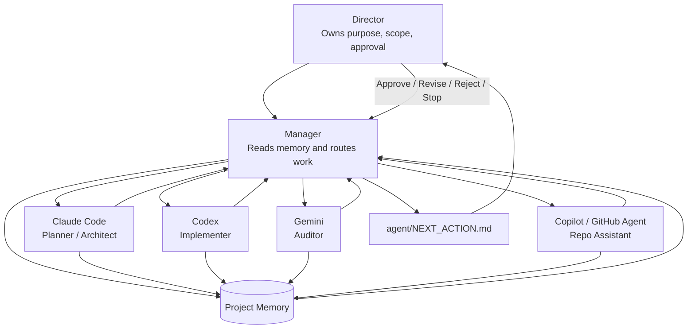
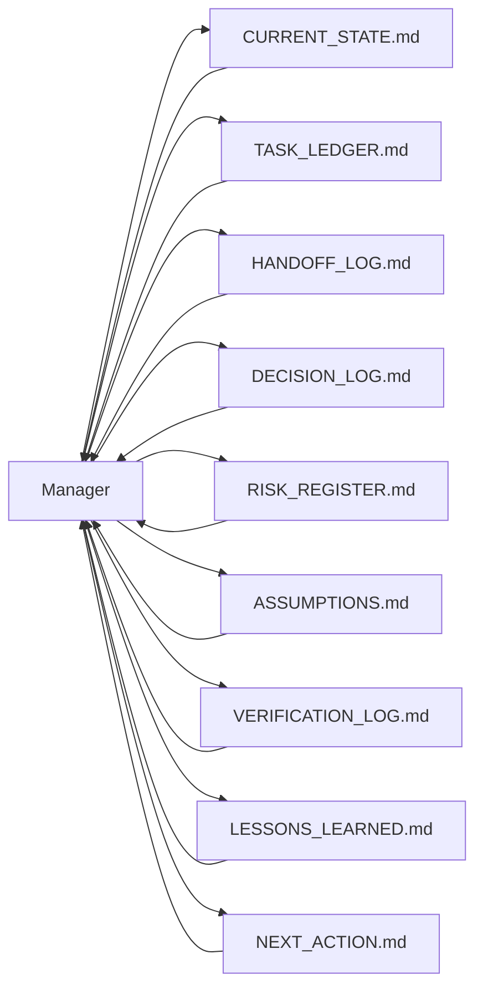
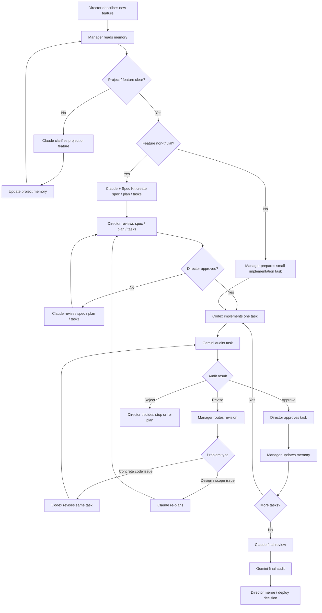
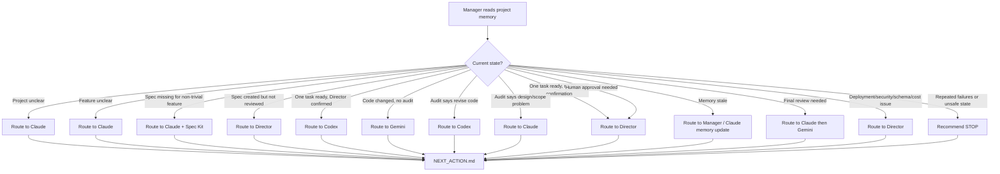
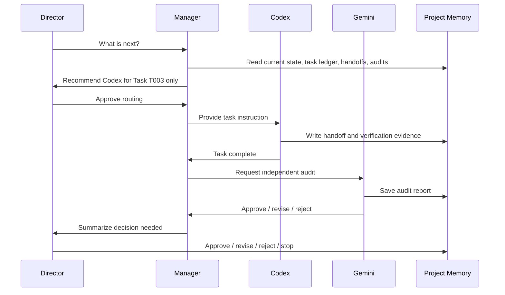
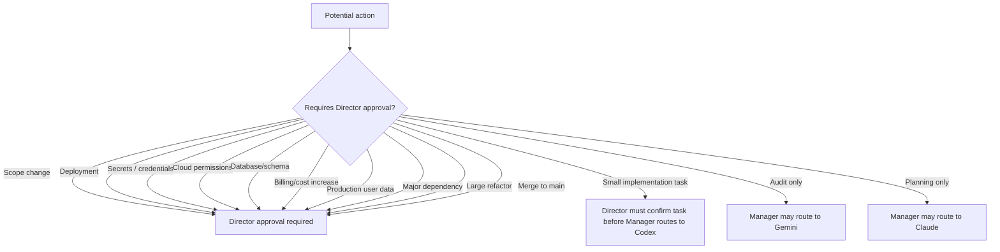
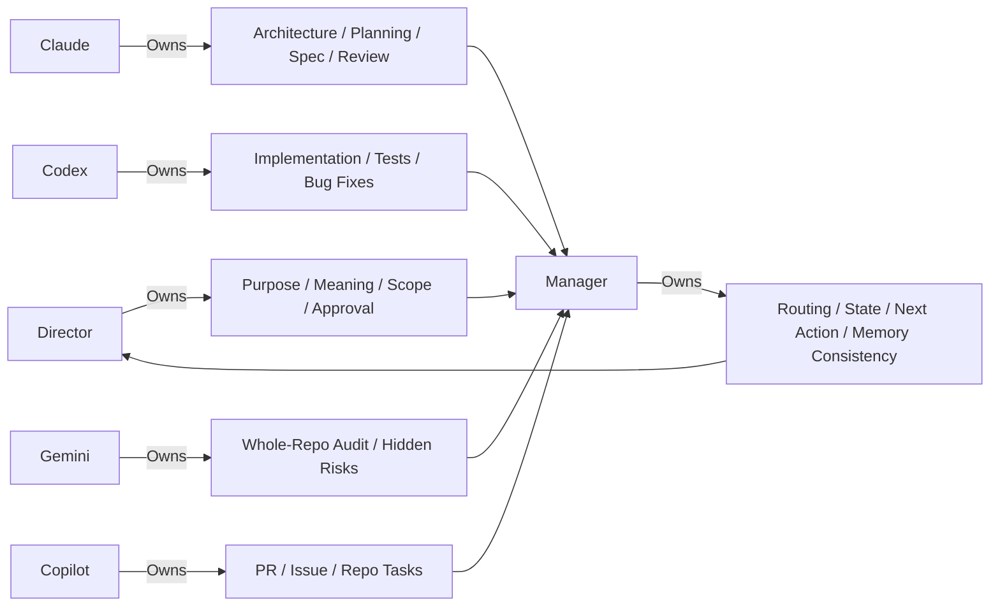

# Director–Manager–Agent Interaction Model

This document explains how the **Director**, **Manager**, and **Agents** interact in this project workflow.

The goal is not full automation. The goal is **director-in-the-loop orchestration**:

> Agents do the work.  
> The Manager coordinates the workflow.  
> The Director owns judgment, purpose, approval, and stopping power.

---

# 1. Roles

## Director

The Director is the human project owner.

The Director owns:

- project purpose
- deliverable
- scope
- final approval
- deployment decisions
- stop / continue decisions
- judgment when agents disagree
- ethics, risk, and real-world meaning

The Director does **not** need to manually remember every detail. The system should surface the next decision clearly.

## Manager

The Manager is the routing and coordination layer.

The Manager reads project memory and decides:

- what state the project is in
- which agent should act next
- whether director approval is required
- what files the Director should review
- what prompt/instruction should be given next
- whether the workflow should stop

The Manager does **not** implement code or approve its own recommendation.

## Agents

Agents are specialized workers.

| Agent | Main Responsibility |
|---|---|
| Claude Code | planning, architecture, Spec Kit, design review |
| Codex | implementation, small patches, tests, bug fixes |
| Gemini | broad-context audit, hidden assumptions, integration risk |
| Copilot / GitHub Agent | PR summaries, issue triage, repo automation |

---

# 2. High-Level Interaction Graph



---

# 3. Project Memory Graph



The Manager should never rely only on chat history. The repo files are the durable project memory.

---

# 4. Normal Feature Workflow



---

# 5. Manager Routing Logic



---

# 6. Task-Level Loop



---

# 7. Approval Gates

The Director must approve before:



---

# 8. What the Manager Produces

The Manager should update:

```text
agent/NEXT_ACTION.md
```

That file should answer:

```text
What happened?
What is the current workflow state?
Who should act next?
What should they do?
What should the Director review?
Is Director approval required?
What is the exact next instruction?
Should we stop?
```

The Director should be able to open `agent/NEXT_ACTION.md` and immediately know what to do.

---

# 9. Responsibility Boundaries



---

# 10. Practical Daily Use

The Director only needs to ask the Manager:

```text
Read MANAGER.md and project memory. What is next?
```

The Manager should respond with:

```text
Current workflow state: NEEDS_REVISION
Recommended next agent: Codex
Human approval required: Yes
Files to review: AUDIT_T003..., data.R diff, TASK_LEDGER.md
Next instruction: [copy-ready prompt]
```

Then the Director decides:

```text
Approve / revise / reject / stop
```

This keeps the workflow human-centered without making the human manually route every step.
