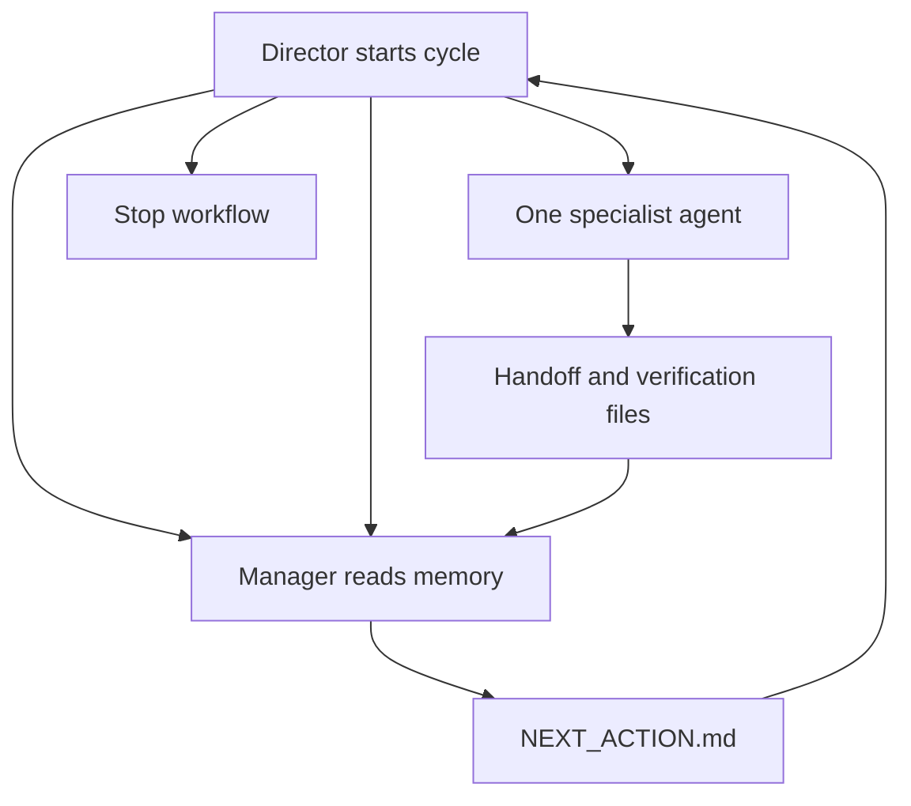

# Director-Manager-Agent Operating Guide

This manual is for the **Director**. The Director owns purpose, scope, approval, and stopping power. The Manager owns workflow-state reconstruction, routing, and next-step recommendations. Specialist agents do one bounded job at a time.

## Manual Tabs

::: {.panel-tabset}

### Intro

#### 1. Director First

- The Director owns objective, deliverable, scope, approval, deployment decisions, and stop decisions.
- The Director does not need to remember the whole project from chat history.
- The Manager's job is to read durable project memory and make the next decision legible.
- If the Director cannot tell what is happening from `agent/NEXT_ACTION.md`, `agent/CURRENT_STATE.md`, and the named review files, the Manager has not done its job yet.

#### 2. Role Boundaries

| Role | Owns | Must Not Own |
|---|---|---|
| Director | Purpose, scope, approval, stop authority | Unreviewed execution by default |
| Manager | Workflow state, routing, next instruction, memory consistency | Coding or approving its own recommendation |
| Claude | Planning, architecture, spec creation, design review | Broad unsupervised implementation |
| Codex | Small contained implementation, fixes, tests, CLI iteration | Redefining requirements or broad redesign |
| Gemini | Independent audit, hidden dependency review, final review | First-pass implementation unless explicitly requested |
| Copilot / GitHub Agent | GitHub-native triage and repo tasks | Project direction |

The safety pattern is:

```text
Director asks
Manager routes
Worker executes one task
Auditor reviews
Director decides
```

#### 3. Control Loop

The Director initiates the loop every time.

1. Ask the Manager what is next.
2. Read the recommendation and named evidence.
3. Decide `approve`, `revise`, `reject`, or `stop`.
4. Allow one bounded task only.
5. Require handoff and verification evidence.
6. Repeat.



### Start & Read

#### 4. How the Director Starts a Project

The Manager does not invent the project. The Director must start it explicitly.

The first Director-to-Manager message should include:

- objective
- deliverable
- current task
- constraints
- out of scope items
- any approvals that must remain human-controlled

Recommended `START` message:

```text
TYPE: START

Context:
We are starting a new project cycle.

Objective:
[one sentence]

Deliverable:
[one sentence]

Current task:
[one sentence]

Constraints:
- [constraint]
- [constraint]

Out of scope:
- [item]
- [item]

What I need from you:
Read AGENTS.md and project memory, determine the current workflow state, identify what memory is missing or stale, tell me what I must review first, and give me the exact next step.
```

If project memory is mostly blank, the first recommendation should be clarification and planning, not implementation.

Bootstrap sequence:

1. Director states the objective and current task.
2. Director asks the Manager to read memory and classify the workflow state.
3. Manager identifies whether memory is missing or stale.
4. If memory is missing or stale, the next recommendation should be clarification or planning.
5. Manager writes `NEXT_ACTION.md`.
6. Director reviews the listed files before approving any implementation.

#### 5. What the Director Should Read First

Read in this order:

1. `agent/NEXT_ACTION.md`
2. `agent/CURRENT_STATE.md`
3. files listed under `Director Must Review Before Continuing`
4. `agent/DECISION_LOG.md` when prior human decisions matter
5. `agent/RISK_REGISTER.md` when risk, scope, deployment, data, or cost are involved

Read as needed:

- `agent/TASK_LEDGER.md`
- `agent/HANDOFF_LOG.md`
- `agent/VERIFICATION_LOG.md`
- `agent/ASSUMPTIONS.md`
- `agent/STOP_RULES.md`

#### 6. How to Read `NEXT_ACTION.md`

The Director should be able to answer these immediately:

- What workflow state are we in?
- What changed last?
- What files must I review?
- Is approval required now?
- Which agent is next?
- What exact next step is being recommended?
- Should the workflow continue, pause, or stop?

If any of those are unclear, choose `revise` rather than `approve`.

### Decide & Run

#### 7. The Four Director Decisions

- `approve`: the next step is scoped, justified, and safe enough to proceed
- `revise`: the direction is plausible but too vague, broad, or unsupported
- `reject`: the proposed next step is wrong, out of order, or conflicts with prior decisions
- `stop`: the workflow must halt until the Director deliberately restarts it

If you want the shortest practical rule: if a stop rule is present, stop; if the step is unclear, revise; if it is wrong or out of order, reject; otherwise approve.

#### 8. Normal Task Cycle

1. Director sends `TYPE: NEXT`.
2. Manager reads project memory.
3. Manager updates `NEXT_ACTION.md`.
4. Director reviews named evidence.
5. Director decides.
6. One specialist agent performs one bounded task.
7. Handoff and verification are written.
8. Independent audit happens when needed.
9. Director decides again.

Preferred sequence:

```text
Claude plans
Codex implements
Gemini audits
Director decides
```

The normal task cycle is: ask for the next step, refresh memory, review evidence, approve one bounded task, write handoff and verification, and audit when needed.

#### 9. Hard Intervention Gates

The Director must intervene before continuation when the next step touches:

- scope change
- deployment
- secrets, credentials, auth, or cloud permissions
- schema or database design
- billing, production infrastructure, or user data
- a major dependency
- repeated failures
- unclear test failures
- conflicting requirements
- oversized or multi-task execution

If the proposed next action touches scope, deployment, credentials, permissions, schema, cost, user data, repeated failure, unclear tests, or conflicting requirements, the Director must intervene.

### Pause / Resume

#### 10. Standard Director-to-Manager Messages

Use explicit message types:

- `START`
- `NEXT`
- `PAUSE`
- `RESUME`
- `BLOCKED`
- `LOST_TRACK`
- `STOP`

Minimum structure:

```text
TYPE: [START / NEXT / PAUSE / RESUME / BLOCKED / LOST_TRACK / STOP]

Context:
[short factual context]

Current task or issue:
[one sentence]

Constraints:
- [constraint]

What I need from you:
[explicit request to Manager]
```

Canonical templates:

```text
TYPE: NEXT

Context:
Continue the active workflow from current project memory.

Current task or issue:
[one sentence]

Constraints:
- Stay within approved scope
- Recommend one bounded next step only

What I need from you:
Tell me the current workflow state, what I need to review now, and the exact next recommended action.
```

```text
TYPE: PAUSE

Context:
We are intentionally pausing work here.

Current task or issue:
[what was in progress]

Constraints:
- Do not treat this as abandonment
- Preserve a clean resume point

What I need from you:
Record the stopping point, what was completed, what is still waiting, what I must review on resume, and what the next recommended step should be when I return.
```

```text
TYPE: RESUME

Context:
I am returning after an interruption.

Current task or issue:
[if known]

Constraints:
- Reconstruct state from project memory first
- Do not assume the prior recommendation is still valid without checking

What I need from you:
Read AGENTS.md, CURRENT_STATE.md, NEXT_ACTION.md, DECISION_LOG.md, and the listed review files. Tell me where we stopped, what is complete, what is waiting, what I must review now, and the exact next step.
```

```text
TYPE: LOST_TRACK

Context:
I no longer trust my understanding of the workflow state.

Current task or issue:
Unknown or partially remembered.

Constraints:
- Reconstruct from project memory only
- Do not fill gaps with assumptions

What I need from you:
Summarize the last completed meaningful step, the active or pending task, the latest human decision, unresolved risks or blockers, what I must review before continuing, and the recommended next step.
```

#### 11. Pause, Resume, Lost Track

Before stopping for the day, the Director should ensure:

- the current decision is recorded
- the latest handoff exists
- `CURRENT_STATE.md` and `NEXT_ACTION.md` reflect the true stopping point
- unresolved blockers or risks are visible

When resuming:

1. send `TYPE: RESUME`
2. read `NEXT_ACTION.md`
3. read `CURRENT_STATE.md`
4. read listed review files
5. confirm whether the prior recommendation is still valid

If the Director has lost track, do not guess. Send `TYPE: LOST_TRACK` and force reconstruction from memory.

For interruptions, the Director sends an explicit message type and the Manager reconstructs or preserves state from project memory before recommending the next step.

#### 12. What Good Director Control Looks Like

Good signals:

- one bounded next step
- correct agent for the task
- named evidence to review
- real verification evidence, not claims
- independent audit for non-trivial work
- memory files consistent with reality

Bad signals:

- multiple tasks bundled into one instruction
- implementation before planning is stable
- no named evidence
- "verified" with no checks
- the same agent planning, implementing, and approving
- quiet scope expansion

### Manager Output

#### 13. Practical Daily Routine

Each cycle:

1. open `NEXT_ACTION.md`
2. open `CURRENT_STATE.md`
3. read the named review files
4. check for a hard gate
5. decide `approve`, `revise`, `reject`, or `stop`
6. if approving, confirm the exact next instruction
7. after execution, confirm the handoff and verification evidence were written

Rule of thumb:

> Never approve a task you cannot describe in one sentence.

#### 14. What the Manager Must Produce

For every meaningful Director message, the Manager should return:

- current workflow state
- what changed most recently
- what the Director must review
- whether approval is required now
- recommended next agent
- exact next action
- whether the workflow should continue, pause, or stop

If the Director still has to reconstruct the workflow from logs, the Manager has failed.

:::
